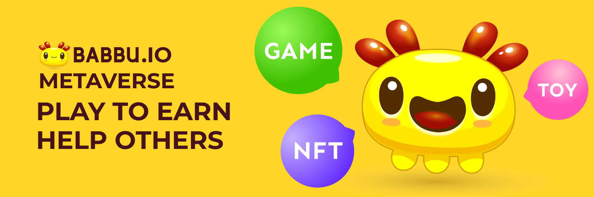

# babbu-core
Babbu smart contracts

NFT (Non-fungible Token), as an important encrypted asset, was known by the blockchain world through CryptoKitties in 2017, the sky-high digital kitty in 2017, the NFT game in 2018, the Ethereum Devcon5 NFT ticket in 2019, DeFi + NFT in 2020… and in 2021, the impact of NFT on the blockchain world has almost exceeded the sum of the past few years: a number of encrypted art NFTs issued by well-known artists were sold for millions or even tens of millions of dollars. NFT is gradually being known to more people. After many ups and downs, I believe that the value of NFT will be fully achieved in the future.
